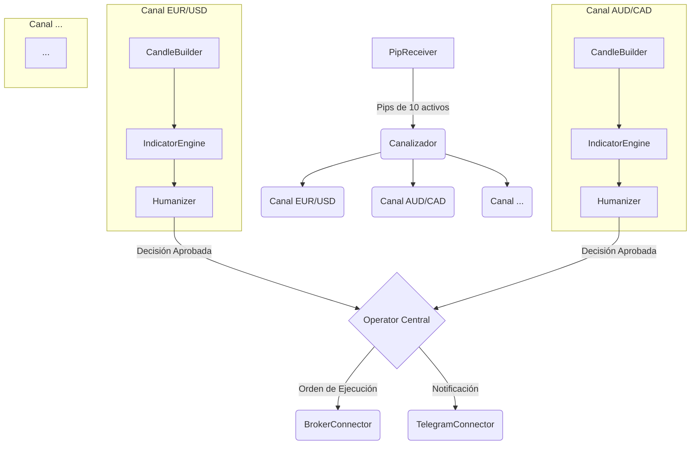

# Bot Fantasma v2.0 - Plataforma de Trading Inteligente Multi-Canal

Este repositorio contiene el código fuente para el **Bot Fantasma**, una plataforma de trading de dos componentes diseñada para operar de forma sigilosa e inteligente, evitando patrones de comportamiento detectables por algoritmos de bróker.

## 🚀 ACTUALIZACIÓN v2.0 - Arquitectura Multi-Canal

### Nuevas Características:
- **ChannelManager**: Sistema central de distribución de pips por activo
- **TradingChannel**: Pipeline independiente por cada activo
- **Métricas Granulares**: Telemetría detallada por canal
- **Modo Dual**: Compatibilidad (1 canal) o Multi-Canal (N canales)
- **Arquitectura Escalable**: Preparada para Worker Threads

El sistema se compone de:
1.  **Analizador de Pips (Python):** Un sensor de alta velocidad que extrae datos del mercado directamente de la fuente.
2.  **Bot de Trading (Node.js):** El cerebro que recibe los datos, analiza, aplica estrategias y ejecuta operaciones.

---

## 📁 Estructura de Archivos

La arquitectura del proyecto está organizada en módulos para una máxima claridad y mantenibilidad.

```
/bot-fantasma
├── /config/                  # Gestión de configuración centralizada (.env)
├── /src/
│   ├── /connectors/          # Módulos para comunicarse con servicios externos (Bróker, Telegram)
│   ├── /logic/               # Lógica de negocio pura (ej. Constructor de Velas)
│   ├── /modules/             # Componentes principales
│   │   ├── ChannelManager.js # [NUEVO] Coordinador central de canales
│   │   ├── TradingChannel.js # [NUEVO] Pipeline completo por activo
│   │   ├── PipReceiver.js    # Receptor de datos del analizador
│   │   ├── IndicatorEngine.js# Motor de análisis técnico
│   │   ├── Humanizer.js      # Sistema anti-detección
│   │   └── Operator.js       # Ejecutor de operaciones
│   └── /utils/               # Funciones de utilidad reutilizables (Logger, TimeUtils)
│
├── .env.example              # Plantilla para el archivo de configuración
├── .gitignore                # Archivos y carpetas a ignorar por Git
├── app.js                    # Punto de entrada principal de la aplicación
└── package.json              # Manifiesto del proyecto y dependencias
```

---

## 🚀 Visión Arquitectónica (Sistema 100% en Producción)

El diseño final del sistema es una arquitectura **multi-canal, paralela y de alta concurrencia**, capaz de vigilar y actuar sobre 10 activos de forma simultánea e independiente.

### Diagrama de Flujo Lógico ("Multi-Canal")



### Capa 1: Recolección y Procesamiento de Datos
* **Receptor de Flujo Masivo:** Recibe el torrente de pips de todos los activos.
* **Canalización por Activo:** Segrega cada pip en un "canal" de procesamiento aislado para su activo.
* **Constructor de Velas por Canal:** Cada canal tiene su propio constructor de velas para múltiples temporalidades (1m, 5m, 15m).

### Capa 2: Análisis e Inteligencia de Señales
* **Análisis en Paralelo:** Cada canal posee su propia instancia del `IndicatorEngine` y `Humanizer`, analizando los 10 activos de forma simultánea.
* **Estrategias de Confluencia:** El `IndicatorEngine` combina múltiples indicadores para generar señales de alta probabilidad.
* **Humanizer por Canal:** Cada `Humanizer` tiene su propia memoria y aplica reglas de evasión avanzadas.

### Capa 3: Ejecución y Gestión de Capital
* **Operator Multi-Canal:** Un `Operator` central escucha las decisiones aprobadas de los 10 canales.
* **Gestión de Capital Avanzada:** Implementa estrategias de Martingala, Stop Loss/Take Profit y stake dinámico.

### Capa 4: Monitoreo y Operación
* **Telemetría Detallada por Canal:** Las notificaciones de Telegram especifican qué activo generó una señal.
* **Dashboard de Mando y Control:** Una interfaz para visualizar el estado de cada canal.
* **Sistema de Salud y Auto-reparación:** Monitorea activamente los recursos del sistema.

---

## 📊 Estado Actual del Desarrollo (v2.0 - Arquitectura Multi-Canal)

El bot es completamente funcional con arquitectura multi-canal en modo compatibilidad.

* **Capa 1: Datos**
    * ✅ Conexión Robusta y Procesamiento de Flujo de Datos.
    * ✅ Constructor de Velas Multi-Activo.
    * ✅ **NUEVO**: ChannelManager distribuye pips por activo.
    * ✅ **NUEVO**: Arquitectura lista para canalización paralela.

* **Capa 2: Análisis**
    * ✅ Motor de Indicadores por Canal (instancia independiente).
    * ✅ Humanizer por Canal (reglas independientes).
    * ✅ **NUEVO**: TradingChannel encapsula el pipeline completo.
    * ⏳ Análisis en Paralelo real (próxima versión).

* **Capa 3: Ejecución**
    * ✅ Operator escucha múltiples canales.
    * ✅ Conector de Bróker Funcional vía WebSocket.
    * ✅ **NUEVO**: Señales incluyen contexto del canal.
    * ❌ Gestión de Capital Avanzada (próxima versión).

* **Capa 4: Monitoreo**
    * ✅ Control del Navegador y Telemetría por Telegram.
    * ✅ **NUEVO**: Métricas detalladas por activo/canal.
    * ✅ **NUEVO**: Reportes periódicos del sistema multi-canal.
    * ❌ Dashboard visual (próxima versión).

### Activación del Modo Multi-Canal

Por defecto, el bot inicia en **modo compatibilidad** (1 canal global). Para activar el procesamiento multi-canal real:

```javascript
// En la consola del bot o mediante comando:
bot.channelManager.setMultiChannelMode(true)
```

---

## 🛠️ Stack Tecnológico

* **Bot de Trading:** Node.js
* **Analizador de Pips:** Python
* **Control de Navegador:** Puppeteer
* **Comunicaciones:** TCP Sockets, WebSockets
* **Notificaciones:** Telegram

---

## ⚙️ Uso y Ejecución

1.  Clonar el repositorio: `git clone https://github.com/Palaleon/bot-fantasma.git`
2.  Navegar a la carpeta del proyecto: `cd bot-fantasma`
3.  Crear el archivo de configuración: `cp .env.example .env` y rellenar los valores.
4.  Instalar dependencias: `npm install`
5.  **Ejecutar primero el Analizador (Python).**
6.  **Ejecutar después el Bot de Trading (Node.js):** `npm start`

## 🔄 Migración de v1.x a v2.0

La versión 2.0 es **100% compatible** con configuraciones anteriores. Los cambios principales son:

1. **Arquitectura interna** mejorada (no afecta la configuración)
2. **Nuevas métricas** disponibles automáticamente
3. **Modo multi-canal** opcional (desactivado por defecto)

### Para aprovechar las nuevas características:

```javascript
// Ver métricas detalladas por activo (se logean automáticamente cada minuto)

// Activar modo multi-canal cuando esté listo
bot.channelManager.setMultiChannelMode(true)

// Ver estado del sistema
bot.channelManager.getSystemStatus()
```