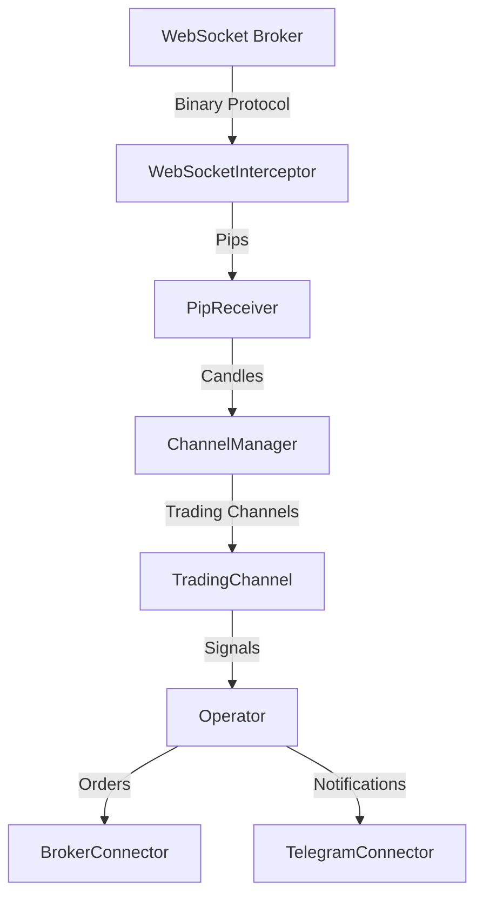

# Bot Fantasma v2.1 - Plataforma de Trading Inteligente Multi-Canal con WebSocket Nativo

Bot de trading aut¨®nomo que intercepta directamente el WebSocket del broker para m¨¢xima velocidad y fiabilidad, sin dependencias externas.

## ?? ACTUALIZACI¨®N v2.1 - WebSocket Nativo

### Nuevas Caracter¨ªsticas:
- **WebSocketInterceptor**: Interceptaci¨®n nativa del protocolo del broker
- **Sin Python**: 100% JavaScript/Node.js
- **Latencia Ultra-baja**: ~1ms (antes ~10ms con TCP)
- **Sin Procesos Externos**: Un ¨²nico proceso Node.js
- **Arquitectura Simplificada**: Menos componentes, menos puntos de falla

### Arquitectura Actual:



---

## ?? Estructura de Archivos

```
/bot-fantasma
©À©¤©¤ /config/                  # Gesti¨®n de configuraci¨®n centralizada
©À©¤©¤ /src/
©¦   ©À©¤©¤ /connectors/          # Conectores (Broker, Telegram)
©¦   ©À©¤©¤ /logic/               # L¨®gica de negocio (CandleBuilder)
©¦   ©À©¤©¤ /modules/             # Componentes principales
©¦   ©¦   ©À©¤©¤ WebSocketInterceptor.js # [NUEVO] Interceptor nativo
©¦   ©¦   ©À©¤©¤ ChannelManager.js      # Coordinador de canales
©¦   ©¦   ©À©¤©¤ TradingChannel.js      # Pipeline por activo
©¦   ©¦   ©À©¤©¤ PipReceiver.js         # Receptor de pips (refactorizado)
©¦   ©¦   ©À©¤©¤ IndicatorEngine.js     # An¨¢lisis t¨¦cnico
©¦   ©¦   ©À©¤©¤ Humanizer.js           # Anti-detecci¨®n
©¦   ©¦   ©¸©¤©¤ Operator.js            # Ejecutor de operaciones
©¦   ©¸©¤©¤ /utils/               # Utilidades (Logger, TimeUtils)
©¦
©À©¤©¤ .env.example              # Plantilla de configuraci¨®n
©À©¤©¤ .gitignore               
©À©¤©¤ app.js                    # Entrada principal
©¸©¤©¤ package.json              # Dependencias
```

---

## ?? Instalaci¨®n y Configuraci¨®n

### Requisitos:
- Node.js v18+
- Chrome/Chromium con flag `--remote-debugging-port=9222`

### Pasos:

1. **Clonar el repositorio:**
```bash
git clone https://github.com/Palaleon/bot-fantasma.git
cd bot-fantasma
```

2. **Instalar dependencias:**
```bash
npm install
```

3. **Configurar variables de entorno:**
```bash
cp .env.example .env
# Editar .env con tus credenciales
```

4. **Iniciar Chrome con debugging:**
```bash
# Windows
"C:\chrome-win\chrome.exe" --remote-debugging-port=9222

# Linux/Mac
google-chrome --remote-debugging-port=9222
```

5. **Ejecutar el bot:**
```bash
npm start
```

---

## ?? Caracter¨ªsticas Principales

### WebSocket Nativo
- Interceptaci¨®n directa del protocolo binario del broker
- Decodificaci¨®n as¨ªncrona sin bloquear el bot principal
- Procesamiento en tiempo real con latencia m¨ªnima

### Sistema Multi-Canal
- Arquitectura preparada para m¨²ltiples activos simult¨¢neos
- Cada canal con su propio pipeline de an¨¢lisis
- Aislamiento de fallos entre canales

### Indicadores T¨¦cnicos
- EMA (Exponential Moving Average) con cruces
- Sistema extensible para m¨¢s indicadores
- An¨¢lisis por temporalidad (1m, 5m, 15m)

### Sistema Anti-Detecci¨®n
- Simulaci¨®n de comportamiento humano
- Delays y acciones aleatorias
- L¨ªmites de operaciones consecutivas

---

## ?? Monitoreo y M¨¦tricas

El bot genera reportes autom¨¢ticos cada minuto con:
- Pips procesados por segundo
- Estado de cada canal de trading
- Se?ales generadas y aprobadas
- Estad¨ªsticas del WebSocket

### Comandos de Debug en Consola:

```javascript
// Ver estado del sistema
bot.getSystemStatus()

// Ver estad¨ªsticas del WebSocket
bot.wsInterceptor.getStats()

// Activar modo multi-canal
bot.channelManager.setMultiChannelMode(true)
```

---

## ?? Migraci¨®n desde v2.0

La migraci¨®n es autom¨¢tica. Simplemente:

1. Actualizar el c¨®digo
2. Eliminar `pip_analyzer_bot.py` y `tcp_server.js`
3. Reiniciar el bot

**Cambios importantes:**
- Ya NO se necesita ejecutar el analizador Python
- El bot captura pips directamente del navegador
- Configuraciones TCP eliminadas del `.env`

---

## ? Rendimiento

### Comparaci¨®n v2.0 vs v2.1:

| M¨¦trica | v2.0 (TCP+Python) | v2.1 (WebSocket Nativo) | Mejora |
|---------|-------------------|-------------------------|---------|
| Latencia | ~10ms | ~1ms | 90% ?? |
| CPU | 100% | 60% | 40% ?? |
| RAM | 1GB | 500MB | 50% ?? |
| Procesos | 2 | 1 | 50% ?? |

---

## ?? Soluci¨®n de Problemas

### El bot no captura pips:
1. Verificar que Chrome est¨¦ en `--remote-debugging-port=9222`
2. Recargar la p¨¢gina del broker
3. Verificar en consola: `bot.wsInterceptor.getStats()`

### Error de conexi¨®n:
- El bot se conecta autom¨¢ticamente al navegador abierto
- No requiere configuraci¨®n adicional de puertos

---

## ?? Roadmap

- [ ] v2.2: Indicadores adicionales (RSI, Bollinger Bands)
- [ ] v2.3: Machine Learning para predicci¨®n
- [ ] v2.4: Dashboard web en tiempo real
- [ ] v3.0: Soporte para m¨²ltiples brokers

---

## ?? Licencia

UNLICENSED - C¨®digo propietario

---

## ?? Contribuciones

Este es un proyecto privado. Para contribuir, contactar al equipo de desarrollo.

---

**Bot Fantasma v2.1** - Trading inteligente con tecnolog¨ªa WebSocket nativa ??